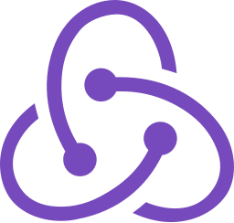

# Hi, I'm Hanming 👋🏼👨🏻‍💻

I'm a Computer Science undergraduate who is passionate about building applications that both look good and do good. Some technologies I enjoy working with include ReactJS, Flutter and Adobe XD (Experience Design). I recently had the chance to lead a team to build [Singapore's COVID-19 contact tracing application](https://www.straitstimes.com/tech/tech-news/nus-team-recognised-for-creating-web-app-to-aid-contact-tracers). My belief in Tech for Good has also led me to co-found an [edutech start-up](https://www.joni.ai) and build [applications for non-profit organisations](https://www.comp.nus.edu.sg/~vwo/projects/2020-lbsa.html).

## Languages & Technologies

 <!-- markdownlint-disable MD033 -->
 <!-- The lack of line breaks within anchor tags is due to a weird underline appearing when line breaks are present. -->

  
  &nbsp;
  
  &nbsp;
  
  &nbsp;
  
  &nbsp;
  
  &nbsp;
  
  &nbsp;
  
  &nbsp;
  
  &nbsp;
  
  &nbsp;
  
  &nbsp;
  
  &nbsp;
  
  &nbsp;
  
  &nbsp;
  

<!-- markdownlint-enable MD033 -->

## Learn more about me at

- [hanmingdev](https://hanmingdev.com), my personal site! 😄
- [LinkedIn](https://www.linkedin.com/in/hanming-zhu/), and connect with me! 💼

<!--
**zhuhanming/zhuhanming** is a ✨ _special_ ✨ repository because its `README.md` (this file) appears on your GitHub profile.

Here are some ideas to get you started:

- 🔭 I’m currently working on ...
- 🌱 I’m currently learning ...
- 👯 I’m looking to collaborate on ...
- 🤔 I’m looking for help with ...
- 💬 Ask me about ...
- 📫 How to reach me: ...
- 😄 Pronouns: ...
- ⚡ Fun fact: ...
-->
